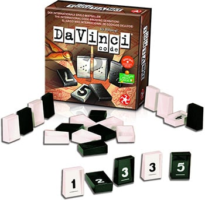

# Sleepy Davinci Code Game

- [Sleepy Davinci Code Game](#sleepy-davinci-code-game)
  - [Links](#links)
  - [Local Develop and Remote Deploy Structure](#local-develop-and-remote-deploy-structure)
  - [Application Logic Structure](#application-logic-structure)
  - [Game Description](#game-description)
  - [Dev Env](#dev-env)
    - [Docker command](#docker-command)
    - [Default dev urls](#default-dev-urls)
  - [Prod Command](#prod-command)

   

## Links

- [demo - dvc.sleepystudio.ga](https://dvc.sleepystudio.ga)
- The structure diagram is generated by [draw.io](https://app.diagrams.net/) 

## Local Develop and Remote Deploy Structure


## Application Logic Structure


## Game Description

Reveal all of your opponent's secret code before they crack yours!

## Dev Env

### Docker command

---
Start dev env

Two ways
1. Copy the dev file
    ```
    cp ./docker-compose-dev.yml  ./docker-compose.yml

    cp .env/.env.default  ./.env
    ```
    
    Run
    ```
    docker-compose up -d
    ```
    to start dev server

2. Run
    ```
    docker-compose -f ./docker-compose-dev.yml up -d
    ```
    to start dev server  

**Follwing commands are based on the first method:**  

Rebuild image
```
docker-compose up --build -d
```
 
Stop docker
```
docker-compose down
```

Access redis container  
```
docker exec -ti redis_cache sh
```
- Start redis interaction
  ```
  redis-cli

  /data # redis-cli
  127.0.0.1:6379>
  ```
- Set value
  ```
  set [KEY] [VAL] EX 60
  ```
- Get value
  ```
  get [KEY]
  ```

### Default dev urls

---
- client   
  http://localhost:3000/   

- server   
  http://localhost:5000/   

- redis commander   
  http://localhost:8081/     

  username/password: admin/admin

## Prod Command

Just Build
```
docker-compose -f ./docker-compose-build.yml build
```

Start prod env as a local test
```
docker-compose -f ./docker-compose-prod.yml up -d --build
```